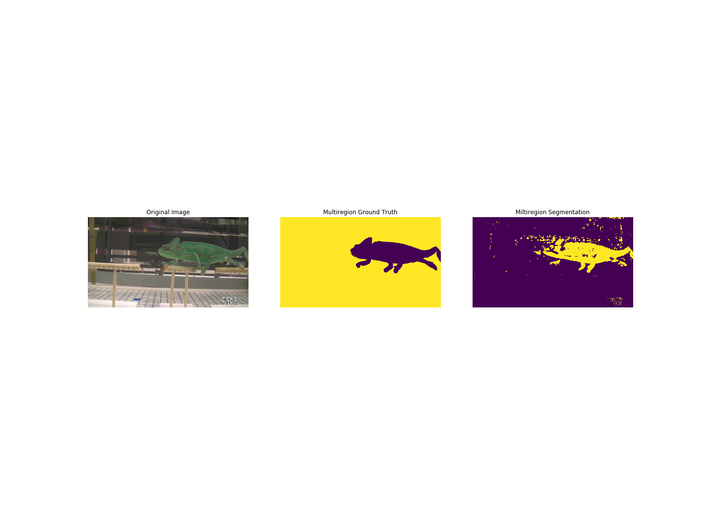

# Summary

As the ability to collect digital data increases, images are used more and more within a wide range of research disciplines. However, processing image data can be difficult and labor-intensive. For example, The first step for researchers to understand their image data is to segment out the image pixels that are of interest to the problem (foreground) and separate them from pixels that are not of interest (background).  Although there are multiple image segmentation algorithms which technique to use depends highly on the information being sought.  Thus building a tool to automatically segment image data often requires a deep understanding of the choices and quite a bit of trial and error to find the right solution.  This project provides a tool (called SEE-Segment) to help researchers navigate the large search space of image segmentation algorithms and their hyperparameters.  SEE-Segment can learn from a single training example and search the "algorithm space" for solutions that may work for the provided problem. The output generated by SEE-Segment is standalone code that is not dependent on SEE-Segment and can easily be copied and pasted into existing data processing workflows. Thus SEE-Segment can also be seen as an educational tool the keeps the researcher-in-the-loop and helps them to understand and use the algorithm choices that are available to them. 

# Statement of Need

Low-cost imaging allow researchers who rely on visual observations to digitally record experiments, resulting in huge databases of images that can be reviewed and re-reviewed over time. "Scientific image understanding" is the process of extracting scientific measurements out of images. Since the information of interest within an image changes with each new research question there is no single "universal measurement" and no single algorithm that can solve every problem. Instead, researchers must manually re-annotate images or write new analysis software every time they want to ask new questions.

Machine learning (ML) offers a way to "automatically" find a customized image analysis algorithm for new research workflows. However, traditional supervised ML approaches (e.g., Artificial Neural Networks) require large datasets of pre-annotated images for training, which creates a circular problem: researchers must manually annotate their images in order to create a training dataset so that traditional ML approaches can find an algorithm to automatically annotate their images. This can be feasible for large, well-funded projects and domains (e.g., Medical Imaging, Self-Driving Cars) but not for smaller, exploratory projects where researchers want to use their data to test simple hypotheses or ask questions that have never been studied before. During this early stage of the scientific process, which we are calling "Exploratory Image Understanding," it is common to manually annotate image and video frame-by-frame, which is an extremely slow process subject to variations in quality and detail.

One of the first steps in image understanding is image segmentation, which attempts to find regions of interest within images. Many image processing algorithms have been developed to try and automatically segment an image. However, there are many different options available, and each algorithm may work best for a different image sets and research questions. Additionally, many of these algorithms have hyperparameters that need to be tuned in order to get the most accurate results. So even if a researcher already possesses knowledge in image understanding and segmentation, it can be time-consuming to run and validate a customized solution for their problem. Thus, if this process could be automated, a significant amount of researcher time could be recovered.

The purpose of the Simple Evolutionary Exploration for segmentation, or SEE-Segment, software package is to provide an easy-to-use tool that can search for image segmentation algorithms. The software vectorizes the algorithms and their hyperparaameters and uses Genetic Algorithms to search this space.  A Labeled Array Distance metric  has been developed to help guild the search.  The resulting solution can be viewed as documented example python code with only minimal/standard dependencies (Numpy, Pillow, scikit-image, etc.) in an effort to make the resulting solution as portable and useful as possible. 

# Design

Development of the SEE-Segment tool has three primary components:

1. Parameter Space
2. Fitness Function
3. Search Algorithm 

The design and implementation of these components are described in more detail below.

## Parameter Space
There are many image segmentation algorithms designed to work on a wide variety of problem. The SEE-Segment tool leverages the extensive list of example algorithms avaliable as part of the SciKit-image segmentation library [@van_der_walt,2014]. Although this is by no means an exhaustive list, the algorithms represented in SciKit-Image provide a good starting point for developing the required algorithm software. Also, the SEE-Segment API is highly configurable so that it is easy to add new algorithms to enrich the possible solutions. As of writing this paper the following segmentation algorithms are included in the SEE-Segment search space: 

* **_Color Threshold_** Basic color based threshold method which looks at a single color channel (ex. gray, red, green blue, etc) and only selects value between two thresholds.  This algorithm represents a "simple" algorithm not included in the scikit-image library (probably due to its simplicity) but still a common solution to many problems.
* **_Felzenszwalb_** Developed by Pedro Felzenszwalb et. al in 2004, the Felzenszwalb algorithm is greedy and runs in O(N), where N is the half of the number of pixels of the image. Using a graph-based representation of the image, the Felzenszwalb algorithm tends to focus more on areas in an image with less variability [@felzenszwalb,2004].
* **_Simple Linear Iterative Clustering (SLIC)_** The SLIC algorithm works by generating superpixels for an image in order to find places to segment an image. Superpixel algorithms like this generally group pixels into meaningful atomic structures as opposed to the rigidity of a pixel grid [@achanta,2012].
* **_Quickshift_** Quickshift connects all points in the image into a tree, then breaks off branches of the tree to find the proper segmentation. An application of mode-seeking and nearest neighbor algorithms; theoretically, Quickshift has advantages in simplicity, speed and generality [@vedaldi,2008].
* **_Watershed_**  The seeded Watershed is a segmentation algorithm based on the Watershed transform. The method is to find different regions, or basins, in an image and fill them, thus forming a segmentation [@meyer,1992]. The compact Watershed applies the Watershed with a compactness parameter which measures the shape, or roundness, of the Watershed basins [@neubert,2014].
* **_Flood Fill_** Given a seed point, Flood Fill will identify or change adjacent pixels based on their similarity to the seed point. This similarity is based on a connectivity parameter which determines the adjacency of pixels as well as a tolerance for how similar the image has to be to the seed point.
* **_Flood_** Similar to the Flood Fill algorithm, Flood returns a Boolean mask of the image. Note that Flood can only be run on grayscale images.
* **_Chan Vese_** While many image segmentation algorithms consider edges, the Chan Vese method ignores edges, instead fitting a piece-wise model to the image [@getreuer,2012]. Note that Chan Vese can also only be run on grayscale images.
* **_Morphological Chan Vese_** The Morphological Chan Vese is also known as the Morphological Active Contours without Edges (MorphACWE).The MorphACWE applies the Chan Vese algorithm using morphological operators as opposed to piecewise models. In particular, the algorithms are the circle\_level\_set and the checkerboard\_level\_set, both of which determine the contours of the image. Like the Chan Vese function, the MorphACWE can only be used on grayscale images.
* **_Morphological Geodesic Active Contour_** The Morphological Geodesic Active Contour (MorphGAC) algorithm applies geodesic active contours with morphological operators. It is particularly useful with segmenting images with noise [@marquez-neila,2014]. While other level sets can be used, the morphological operators that we chose to use were the given circle\_level\_set and checkerboard\_level\_set. Additionally, this algorithm requires that the input image be preprocessed using the inverse\_gaussian\_gradient function.

## Fitness Function
The second key element required to build the SEE-Segment tool is a fitness function that can be used to compare two different algorithms.   A labeled array is a common product of image segmentation algorithms that provides a label for each pixel in an image.  Binary segmentation only provides two labels ("foreground" and "background") which can be represented by a simple binary matrix, however, many image segmentation algorithms output multiple regions using a labeled array.   The SEE-Segment tool uses a unique Labeled Array Distance (LAD) metric to provide the distance between two labeled images. In this way the accuracy of different image segmentation algorithms can be compared by measuring their individual output labeled array against hand labeled "ground truth" array. The resulting fitness function also provides a simple "confidence measure" to give the research some insight on the quality and potential reliability of the  solution. 

## Search Algorithm
Although there are many optimization and search algorithms that could be adapted to work; the SEE-Segment tool currently utilizes Genetic Algorithms (GA) to search the image segmentation "algorithm space". GAs have some great engineering strengths including:

* Simple to implement
* Highly scalable
* Able to find solutions in non-linear, non-differentiable search spaces
* Easily adaptable to different workflows
* Incremental learning
* Extremely easy to apply engineered “seed” solutions to accelerate the search
* Easily applied to cross-learning approaches between different problem spaces
* Solutions that are human interpretable.

# Concluding Remarks

The SEE-Segment library can be used to help researchers explore the wide range of segmentation algorithms available for individual research problems.  The search process is highly transparent and allows research to learn and understand what works and what doesn't work for their particular dataset. Although we hope the tool will be able to automatically find solutions it has been designed to include the researcher-in-the-loop and be transparent so it will work as an educational tool for research's who's area of expertise may be outside of programming and/or scientific image understanding.    

Segmentation is only one of many workflows researchers use to understand their image data. The SEE-Segment is potentially the first of many tools that are designed to speed up researcher learning and reduce the "mean time to science".  The SEE-Insight team is planning to continue to contribute in this area on four fronts:

- Continuous improvment of the SEE-Segment search space and search tools.
- Parameterizing and searching other image understanding workflows such as classification, counting, and point selection. 
- Scaling the software to leverage Advanced Computing Hardware (such as HPC and cloud based resources)
- Development of a Graphical User Interfaces to assist in the manual annotation of images while the search is conducted in the background. 

In addition to the above, the SEE-Segment tool is being used in courses to train graduate students how to program image understanding tools and helping them utilize these tools on data related directly to their own research. 

# References